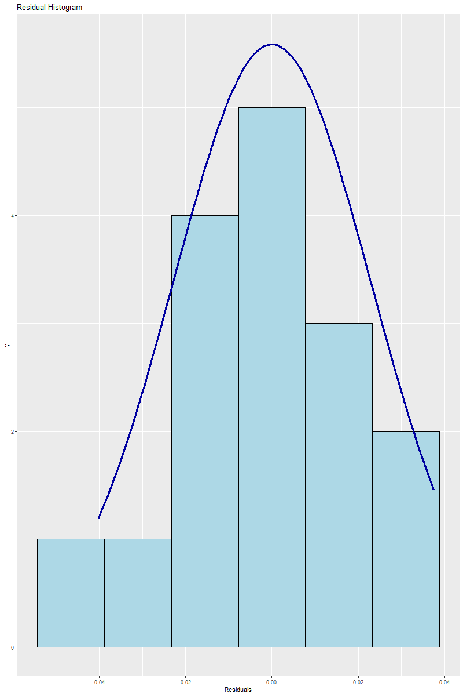

# Regression Analysis using R

## Introduction

This project performs a regression analysis using R to investigate the relationships between various macroeconomic indicators. The dataset includes indicators such as GDP, consumption (C), reserves (R), trade (TRADE), current account balance (CA), and foreign direct investment (FDI). The goal is to predict PD (Probability of Default) using these predictors.

## Steps of Analysis

### 1. **Loading Libraries**

```R
# Load libraries
library(readxl)
library(MASS)
library(caTools)
library(car)
library(quantmod)
library(corrplot)
library(lmtest)
library(zoo)
library(skedastic)
library(olsrr)
```

We start by loading all the necessary libraries for the analysis, including tools for regression modeling, diagnostic testing, and data visualization.

---

### 2. **Loading Data and Building the Regression Model**

```R
# Load data and build the regression model
indicators <- read_excel(".\\Macro-indicators.xlsx")
full_model <- lm(PD ~ GDP + C + R + TRADE + CA + FDI, data = indicators)
```

We load the dataset and fit a multiple linear regression model to predict `PD` using all available predictors.

---

### 3. **Performing Stepwise Model Selection**

```R
# Perform stepwise model selection
step_model <- stepAIC(full_model, direction = "both", trace = FALSE)
print(summary(step_model))
```

#### Output:

```
Call:
lm(formula = PD ~ C + R + TRADE, data = indicators)

Residuals:
      Min        1Q    Median        3Q       Max
-0.040150 -0.017540  0.000929  0.016351  0.037508

Coefficients:
              Estimate Std. Error t value Pr(>|t|)
(Intercept)  1.437e-01  1.309e-01   1.098 0.293773
C            7.678e-04  1.056e-04   7.268 9.90e-06 ***
R           -1.746e-02  2.456e-03  -7.110 1.23e-05 ***
TRADE        5.246e-05  9.897e-06   5.301 0.000188 ***
---
Residual standard error: 0.02556 on 12 degrees of freedom
Multiple R-squared:  0.901, Adjusted R-squared:  0.8762
F-statistic: 36.38 on 3 and 12 DF,  p-value: 2.649e-06
```

**Comment:**  
Stepwise regression selects the most important predictors (`C`, `R`, `TRADE`). The model has a high R-squared (0.901), indicating that 90.1% of the variation in PD is explained by these variables.

---

### 4. **Calculating Variance Inflation Factors (VIF)**

```R
# Calculate Variance Inflation Factors (VIF)
vif(step_model)
```

#### Output:

```
       C        R    TRADE
1.001840 1.111056 1.110801
```

**Comment:**  
VIF values for all variables are close to 1, indicating no significant multicollinearity between predictors in the model.

---

### 5. **Correlation Matrix and Visualization**

```R
# Correlation Matrix and Visualization
print(corrplot(cor(indicators), method = "number"))
```

#### Output:

```
$corr
              PD           C        GDP           R          CA       TRADE
PD     1.0000000  0.63077031  0.6243109 -0.50330289 -0.56830244  0.27853462
...
```

**Comment:**  
The correlation matrix shows the strength and direction of the relationships between the variables. For example, `C` and `PD` have a positive correlation (0.63), while `R` and `PD` have a negative correlation (-0.50).

---

### 6. **Plotting VIF Values**

```R
# Plotting VIF values
print(barplot(vif_values, main = "VIF Values", horiz = TRUE, col = "steelblue"))
abline(v = 5, lwd = 3, lty = 2)
```

**Comment:**  
The barplot of VIF values visualizes multicollinearity, with no values exceeding the threshold of 5, reinforcing the absence of multicollinearity.

---

### 7. **Testing for Non-Constant Variance (Homoscedasticity)**

```R
# Test for non-constant variance (homoscedasticity)
print(ncvTest(step_model))
```

#### Output:

```
Non-constant Variance Score Test
Chisquare = 0.3716, Df = 1, p = 0.5421
```

**Comment:**  
The non-constant variance (ncv) test results in a p-value > 0.05, indicating no evidence of heteroscedasticity, and thus, the assumption of constant variance holds.

---

### 8. **Diagnostic Plots**

```R
# Diagnostic plots and tests
par(mfrow = c(2, 2))
print(plot(step_model))
```

**Comment:**  
The diagnostic plots help assess the assumptions of the regression model. Residuals appear normally distributed and evenly spread, supporting model validity.

---

### 9. **Breusch-Pagan Test for Heteroscedasticity**

```R
# Breusch-Pagan Test for Heteroscedasticity
print(bptest(step_model))
```

#### Output:

```
BP = 3.5868, df = 3, p-value = 0.3097
```

**Comment:**  
The Breusch-Pagan test also shows a p-value > 0.05, confirming that the model does not suffer from heteroscedasticity.

---

### 10. **Testing for Autocorrelation**

```R
# Test for Autocorrelation
acf(step_model$residuals, type = "correlation")
print(dwtest(step_model))
```

#### Output:

```
Durbin-Watson test
DW = 2.0302, p-value = 0.3186
```

**Comment:**  
The Durbin-Watson test indicates no significant autocorrelation in the residuals, with the p-value > 0.05 and a Durbin-Watson statistic close to 2.

```R
# Breusch-Godfrey test for serial correlation of order up to 3
print(bgtest(step_model, order=3))
```

#### Output:

```
LM test = 4.4832, df = 3, p-value = 0.2138
```

**Comment:**  
The Breusch-Godfrey test confirms the absence of serial correlation in the residuals.

---

### 11. **Testing for Normality of Residuals**

```R
# Test for normality of residuals
print(ols_plot_resid_qq(step_model))
print(ols_plot_resid_hist(step_model))
print(ols_test_normality(step_model))
```

#### Output:

```
Test             Statistic       pvalue
Shapiro-Wilk              0.9705         0.8459
Kolmogorov-Smirnov        0.1099         0.9786
Cramer-von Mises           5.09          0.0000
Anderson-Darling          0.1943         0.8727
```


**Comment:**  
The normality tests (Shapiro-Wilk, Kolmogorov-Smirnov, Anderson-Darling) indicate that the residuals are normally distributed, as the p-values for all tests are > 0.05, except for Cramer-von Mises, which may not be of primary concern here.

---

## Conclusion

The stepwise regression model effectively identifies the key predictors of `PD` as `C`, `R`, and `TRADE`, with no evidence of multicollinearity, heteroscedasticity, or autocorrelation in the residuals. All diagnostic tests confirm the robustness of the model. The dataset and the final regression model provide insightful findings into the relationships between macroeconomic indicators and `PD`.

### Future Steps:

-   Explore additional models for comparison.
-   Refine the model using interaction terms or non-linear transformations if necessary.
